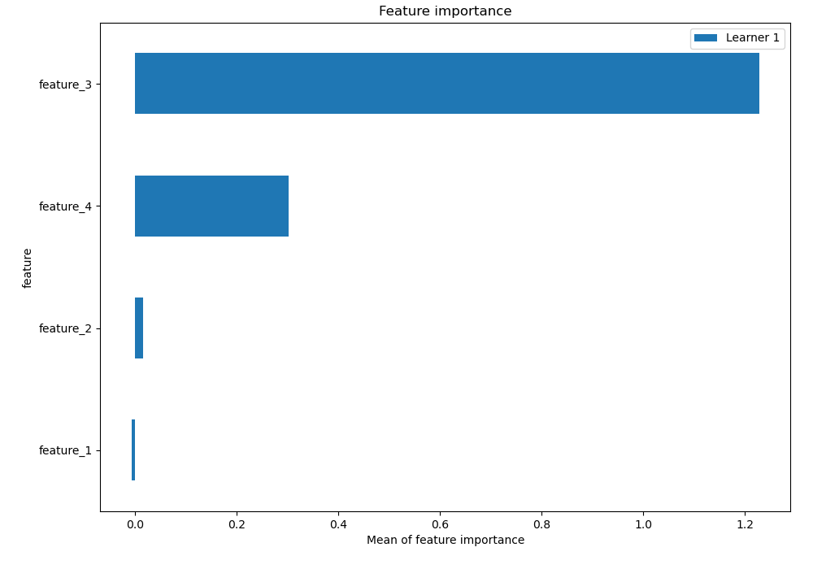

# Summary of 11_Xgboost

[<< Go back](../README.md)

## Extreme Gradient Boosting (Xgboost)
- **n_jobs**: -1
- **objective**: multi:softprob
- **eta**: 0.1
- **max_depth**: 6
- **min_child_weight**: 1
- **subsample**: 1.0
- **colsample_bytree**: 0.9
- **eval_metric**: mlogloss
- **num_class**: 3
- **explain_level**: 1

## Validation
 - **validation_type**: split
 - **train_ratio**: 0.75
 - **shuffle**: True
 - **stratify**: True

## Optimized metric
logloss

## Training time

0.6 seconds

### Metric details
|           |   0 |         1 |         2 |   accuracy |   macro avg |   weighted avg |   logloss |
|:----------|----:|----------:|----------:|-----------:|------------:|---------------:|----------:|
| precision |   1 |  0.928571 |  1        |   0.973684 |    0.97619  |       0.975564 | 0.0714493 |
| recall    |   1 |  1        |  0.923077 |   0.973684 |    0.974359 |       0.973684 | 0.0714493 |
| f1-score  |   1 |  0.962963 |  0.96     |   0.973684 |    0.974321 |       0.973645 | 0.0714493 |
| support   |  12 | 13        | 13        |   0.973684 |   38        |      38        | 0.0714493 |

## Confusion matrix
|              |   Predicted as 0 |   Predicted as 1 |   Predicted as 2 |
|:-------------|-----------------:|-----------------:|-----------------:|
| Labeled as 0 |               12 |                0 |                0 |
| Labeled as 1 |                0 |               13 |                0 |
| Labeled as 2 |                0 |                1 |               12 |

## Learning curves

## Permutation-based Importance

## Confusion Matrix

## Normalized Confusion Matrix

## ROC Curve

## Precision Recall Curve

[<< Go back](../README.md)
