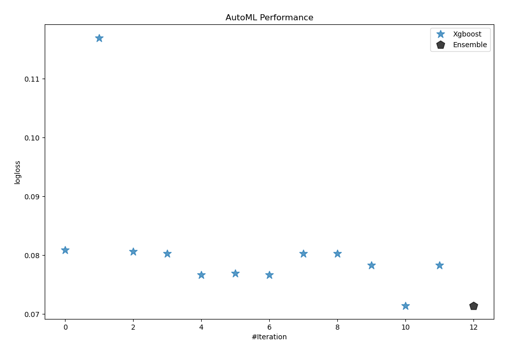
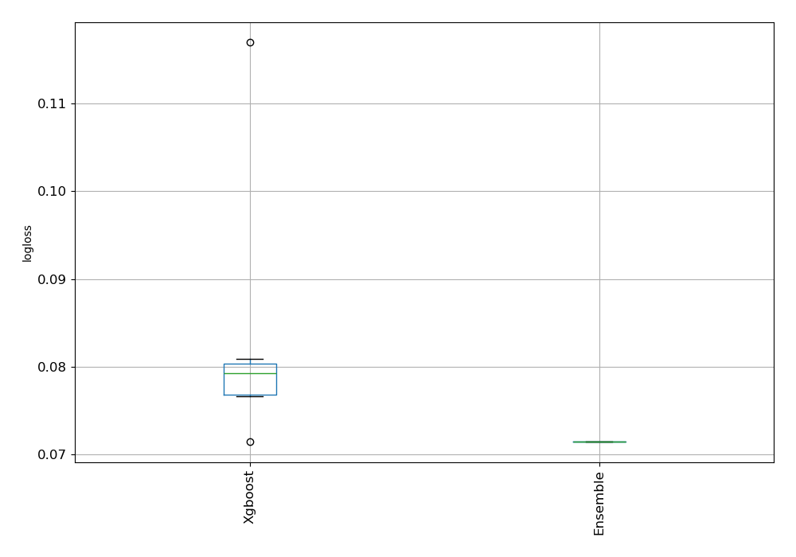
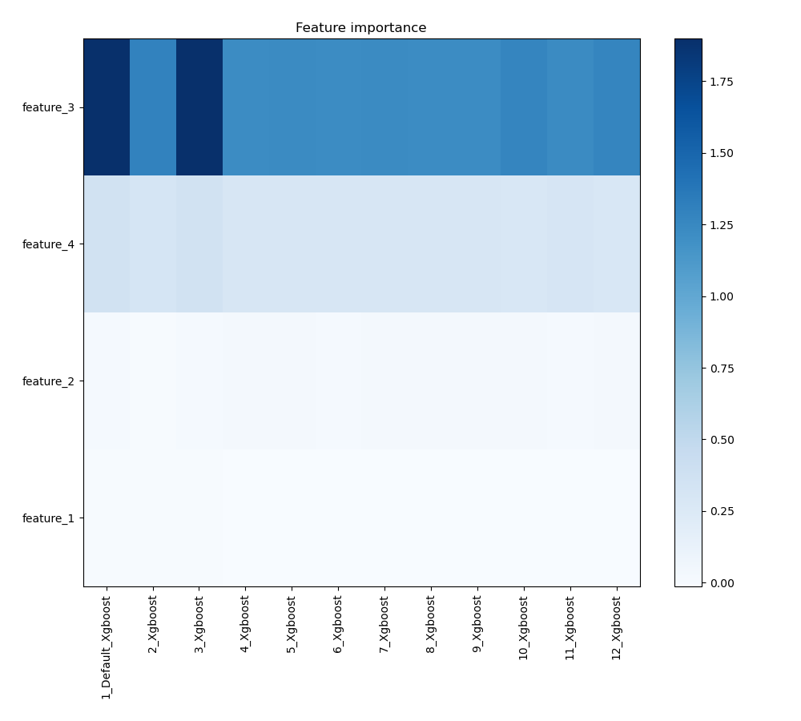
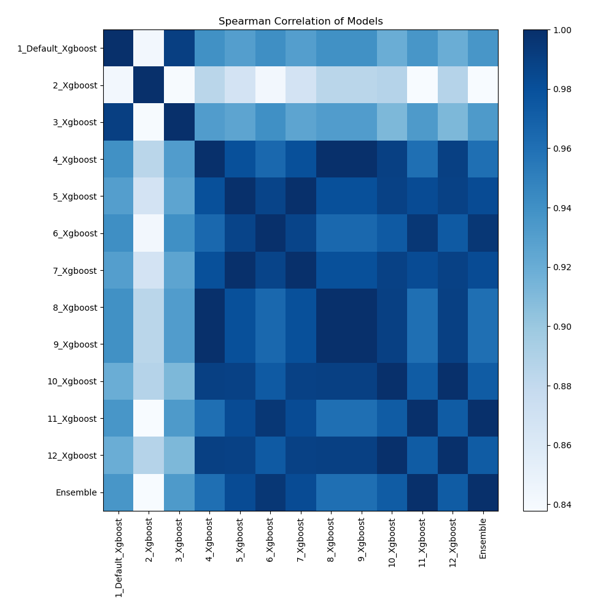

# AutoML Leaderboard

| Best model   | name                                             | model_type   | metric_type   |   metric_value |   train_time |
|:-------------|:-------------------------------------------------|:-------------|:--------------|---------------:|-------------:|
|              | [1_Default_Xgboost](1_Default_Xgboost/README.md) | Xgboost      | logloss       |      0.0808907 |         9.38 |
|              | [2_Xgboost](2_Xgboost/README.md)                 | Xgboost      | logloss       |      0.116975  |         7.99 |
|              | [3_Xgboost](3_Xgboost/README.md)                 | Xgboost      | logloss       |      0.0805938 |         7.63 |
|              | [4_Xgboost](4_Xgboost/README.md)                 | Xgboost      | logloss       |      0.0802712 |         1.43 |
|              | [5_Xgboost](5_Xgboost/README.md)                 | Xgboost      | logloss       |      0.0766884 |         1.32 |
|              | [6_Xgboost](6_Xgboost/README.md)                 | Xgboost      | logloss       |      0.0769138 |         1.41 |
|              | [7_Xgboost](7_Xgboost/README.md)                 | Xgboost      | logloss       |      0.0766884 |         1.39 |
|              | [8_Xgboost](8_Xgboost/README.md)                 | Xgboost      | logloss       |      0.0802712 |         1.35 |
|              | [9_Xgboost](9_Xgboost/README.md)                 | Xgboost      | logloss       |      0.0802712 |         1.3  |
|              | [10_Xgboost](10_Xgboost/README.md)               | Xgboost      | logloss       |      0.0782895 |         1.58 |
| **the best** | [11_Xgboost](11_Xgboost/README.md)               | Xgboost      | logloss       |      0.0714493 |         1.38 |
|              | [12_Xgboost](12_Xgboost/README.md)               | Xgboost      | logloss       |      0.0782895 |         1.59 |
|              | [Ensemble](Ensemble/README.md)                   | Ensemble     | logloss       |      0.0714492 |         1.06 |

### AutoML Performance

### AutoML Performance Boxplot

### Features Importance

### Spearman Correlation of Models

